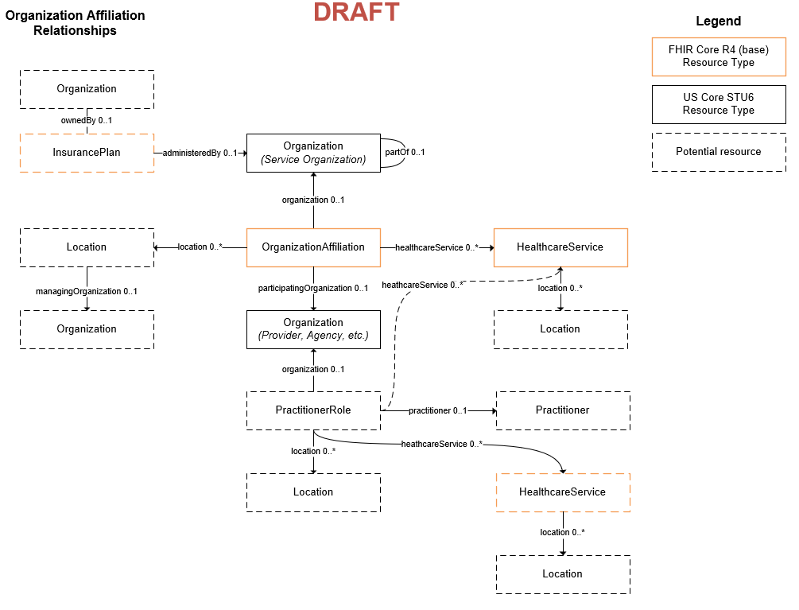

## {{page-title}}

### Context
This is the administration module for Organiation Services, which defines the relationship between service organizations, provider agencies, and locations and the types of programs, services, and procedures they are able to provide.

### FHIR Focus Resource Types

| Name                      | Aliases                                   | Description |
| --- | --- | --- |
| [Organization](https://hl7.org/fhir/us/core/StructureDefinition-us-core-organization.html)              | Provider, Agency, County, Location        | --- |
| [OrganizationAffiliation](https://hl7.org/fhir/R5/organizationaffiliation.html)   | --- | --- |
| [HealthcareService](http://hl7.org/fhir/R4/healthcareservice.html)         | Program, Services, Service Categories, Procedure codes | --- |
| [Location](https://hl7.org/fhir/us/core/StructureDefinition-us-core-location.html)                  | --- | --- |

### Conceptual Model

### Examples

