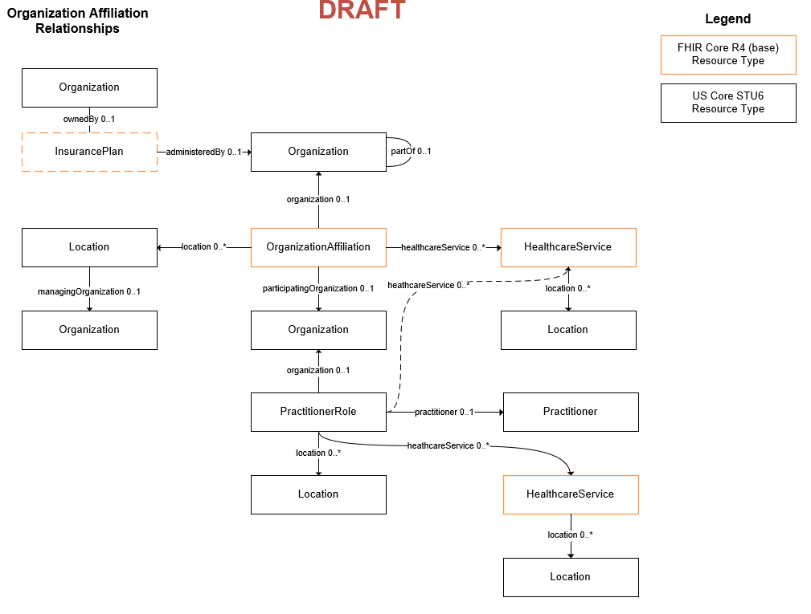

## {{page-title}}

### Context

### FHIR Focus Resource Types

| Name                      | Aliases                                   | Description |
| --- | --- | --- |
| [Organization](https://hl7.org/fhir/us/core/StructureDefinition-us-core-organization.html)              | Provider, Agency, County, Location        | --- |
| [OrganizationAffiliation](https://hl7.org/fhir/R5/organizationaffiliation.html)   | --- | --- |
| [HealthcareService](http://hl7.org/fhir/R4/healthcareservice.html)         | Program, Services, Service Categories, Procedure codes | --- |
| [Location](https://hl7.org/fhir/us/core/StructureDefinition-us-core-location.html)                  | --- | --- |

### Conceptual Model

### Examples

